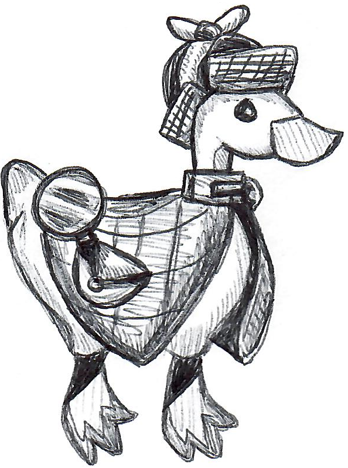

# MNIST Guessing Goose

This is a Goose that's taken a few ML classes. It knows 
about `Convolutional Neural Networks` and taught itself how to read with the
`MNIST` dataset. However, it only knows how to read numbers.

https://saraelz.github.io/guessing-goose-ml-cnn/

### Client-Side Execution with Tensorflow.js
Website uses `Tensorflow.js` to run client-side Tensorflow Models. This means
that everything is running in your browser with no backend servers. The model
was train in `Python` using `Keras`, then exported to Tensorflow.

### Front-end
Written in React + Typescript. In order to make the website responsive,
all ML processing runs in the background with service-workers.
